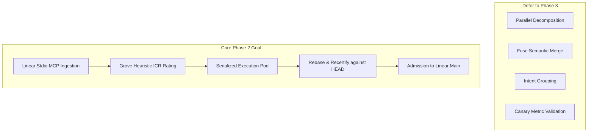

# Relay Core Architecture & Design Review Critique

---

## 1. Critique of Core Architecture Decisions

### Decision 1: ICR Isolation Replaces Branches (High Risk)
* **The flaw:** Symbol-level isolation is not equivalent to semantic isolation. 
* **Where it breaks:**
  * **File appends:** Two agents adding independent symbols to the same config, registry, router, or database migration file will not trigger symbol collisions under Grove's `/icr`. However, they will produce concurrent line-item appends or sequential dependencies (such as micro-migrations) that will break downstream.
  * **Dynamic resolving:** In languages with reflection or dependency injection, changed symbol names may resolve cleanly at parse time, but fail at runtime.
  * **Scale:** Graph edge confidence is treated as binary, but edge detection yields varying certainties. A missing or low-confidence `calls` edge means Relay will schedule unsafely.
* **Verdict:** Do not position ICR as a replacement for branches. Instead, use ICR as a **scheduling optimizer** that guides concurrency, with Fuse and post-rebase certification serving as the actual safety boundary.

### Decision 2: Linear Main, No Branches (Medium Risk)
* **The flaw:** The audit trail overhead is offloaded entirely to commit trailers.
* **Where it breaks:** If an agent takes 20 minutes to execute and certify, and HEAD has moved forward by 10 commits, the agent's work must be rebased. In a high-concurrency dev shop, some intents will starve in a perpetual "rebase-certify-fail-retry" loop (the "Priority inversion and head starvation" problem).
* **Verdict:** Linear main is operationally clean, but it necessitates a priority queue and a fast-path certification tier so rebases can commit within seconds under low-conflict conditions.

### Decision 3: Intent as the Review Artifact (Solid)
* **Verdict:** This is the strongest thesis in the design document. Reviewing human intent rather than machine diffs scales with AI volume.
* **Friction point:** Developers write notoriously bad descriptions. If the intent description is lazy, the computed ICR will be wrong, and the agent will produce wrong code that still passes unit tests. Relay must enforce strict template validation, automatic schema-guided linting, and interactive agent-guided refinement *before* intent approval.

### Decision 4: Git-Native Intent Store (Weak)
* **The flaw:** Using a Git repo (`intent-store`) as the primary database for live coordination is slow and subject to locks.
* **Verdict:** The proposed hybrid model in Phase 2 (Postgres for mutable/queryable operational state, Git for immutable audit trail snapshots on state transition) is correct and resolves these performance limitations.

---

## 2. Answers to Specific Questions for the Reviewer

### 1. Are there fundamental flaws in the ICR isolation model?
Yes. It assumes codebase safety is defined purely by symbol node separation. It fails to account for:
1. Shared sequential resources (changelogs, migration indexes).
2. Global state modification (mutating system-wide environment variables).
3. Non-symbol assets (JSON configuration schemas, Dockerfiles, package metadata).

### 2. Is the three-repo model operationally sound?
No. Maintaining `source-repo`, `intent-store`, and `platform-config` separately introduces high synchronization complexity, dual-state consistency drift, and friction for local developer setup. 
* **Recommendation:** Merge `platform-config` and `intent-store` protocols directly into `.relay/` inside the `source-repo`. This ties intent history directly to code evolution.

### 3. Is "Claude only, no multi-provider" the right call?
Yes, for Phase 2. Support for multi-providers introduces significant context packet translation overhead for very little reward. Keep the focus on architecture.

### 4. What is missing from the intent YAML schema?
The current spec is missing:
* `allowed_paths` / `forbidden_paths` (security sandbox limits).
* `verification_plan` (instructions for the certification engine beyond basic testing).
* `ambiguity_policy` (tells the agent whether to fail fast or proceed autonomously on missing metrics).
* `rollback_strategy` (what steps to run if live canary metrics fail).

### 5. What is the biggest unidentified Phase 2 risk?
**Wrong Successful Changes.**
An agent can execute an intent, introduce a subtle architectural deviation, pass all unit/integration tests, and satisfy the literal acceptance criteria, while breaking system conventions (e.g. adding raw querying inside a service layer instead of using the repository pattern). **Certification must inspect compliance with linter policies, path restrictions, and architectural boundary rules, not just test suites.**

### 6. Should Relay handle infrastructure in Phase 2?
No. Defer it. Infrastructure changes (Terraform, K8s manifests) have immense blast radiuses and lack unit test environments. Keep Phase 2 strictly code-only.

### 7. Is there a simpler design?
Yes. Defer parallel agent execution, decomposition, and Fuse merge entirely in Phase 2.
1. Run one agent loop at a time (sequential execution).
2. Build the intent intake + Grove `/icr` analysis.
3. Validate the computed ICR boundaries against subsequent human-guided executions.
4. Scale to multi-agent parallelism only after you have empirical data showing ICR predictions are accurate.

---

## 3. Recommended Phase 2 Scope Adjustment

I recommend executing a more focused Phase 2 that prioritizes reliability over complex concurrency features:

By prioritizing the sequential intent-to-certified-commit loop with strict pre-admission re-certification, you establish a battle-tested safety foundation before tackling the complex scheduler required for concurrent merges.
